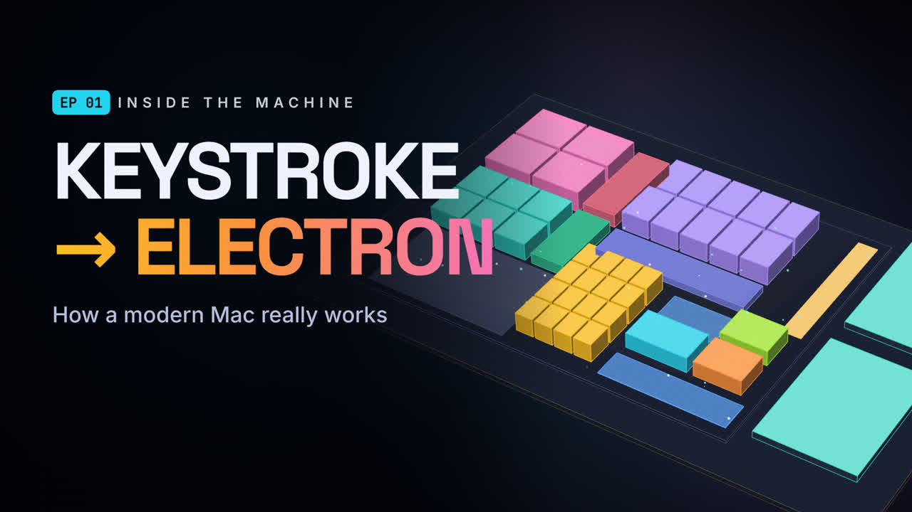
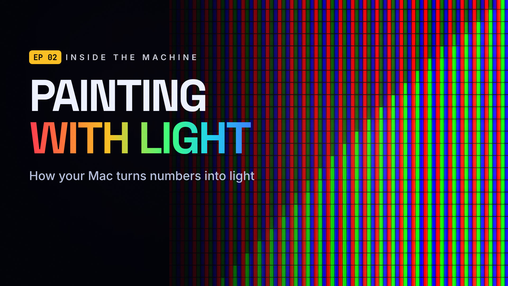
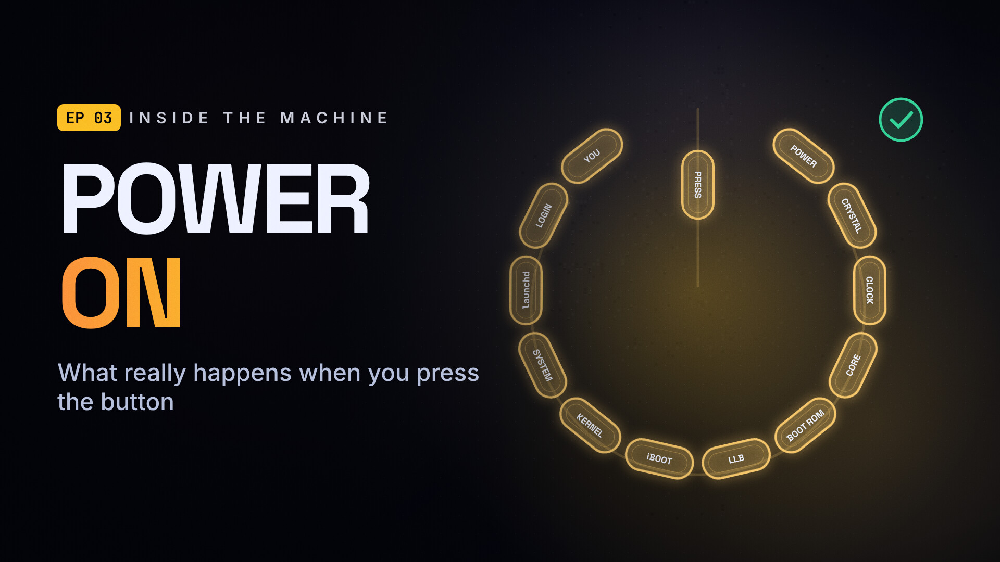
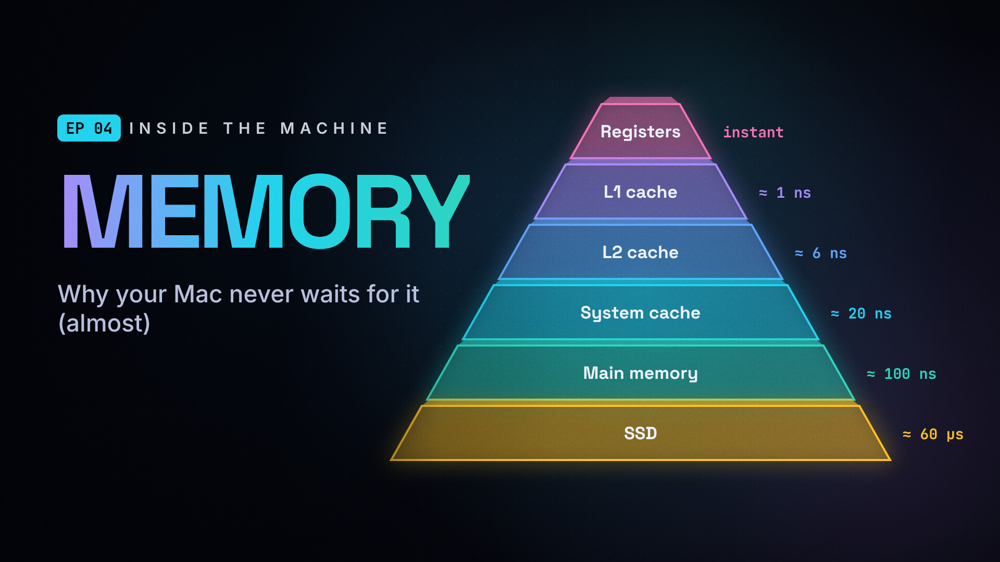
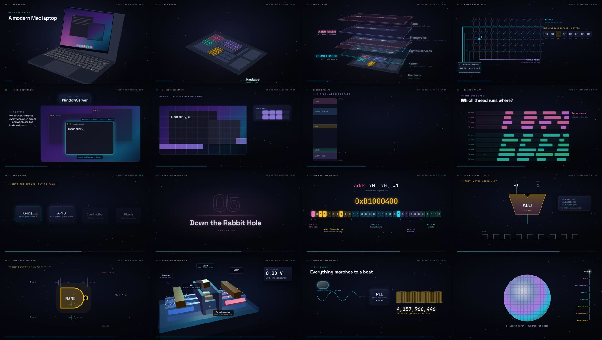
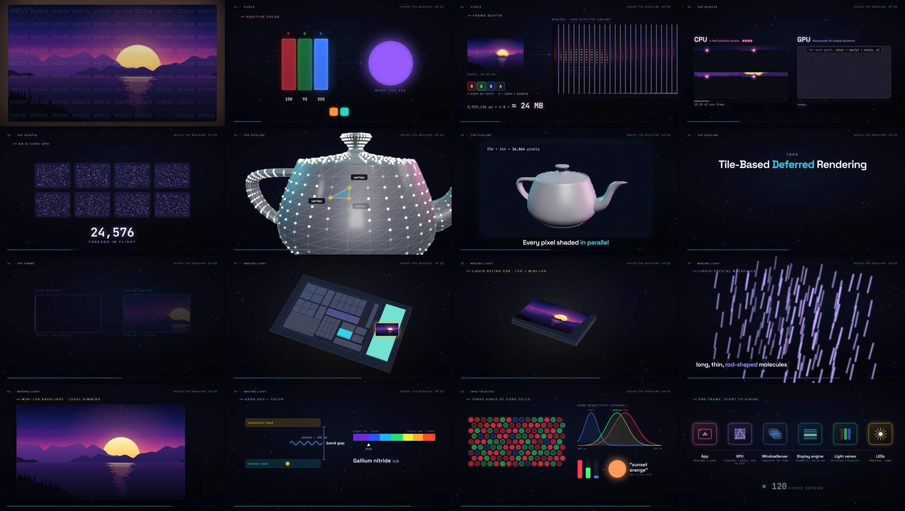
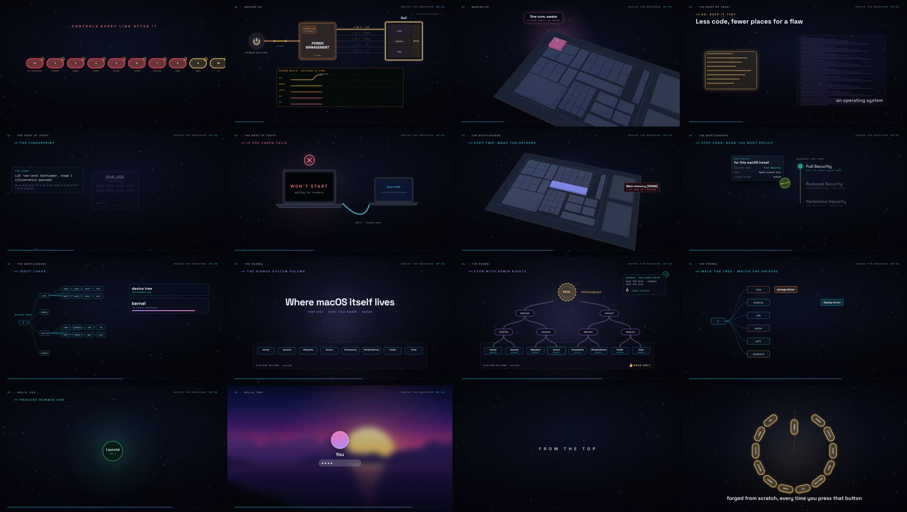
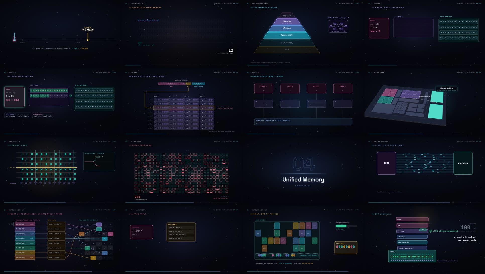

# INSIDE THE MACHINE

**A cinematic explainer series about how computers really work — built entirely in code.**

| Episode 01 | Episode 02 |
|---|---|
|  |  |
| **From Keystroke → Electron** — how a modern Mac really works (≈ 11 min) | **Painting with Light** — how your Mac turns numbers into light (≈ 9 min) |

| Episode 03 | Episode 04 |
|---|---|
|  |  |
| **Power On** — from the power button to your desktop (≈ 6.5 min) | **Memory** — where your data lives, and how the chip gets to it so fast (≈ 7.5 min) |

### Episode 01 — From Keystroke → Electron (1080p30)

You press one key. We follow that press through every layer of a modern Apple‑silicon Mac — the key matrix, the
HID report, the interrupt, the kernel, the WindowServer, the app's run loop, Unicode, font outlines, rasterization,
the tile‑based GPU and the display's subpixels — then open an app (processes, virtual memory, page faults, the P/E‑core
scheduler), save a file (system calls, APFS, 3D NAND, charge‑trap cells) and finally dive all the way down: Swift →
ARM64 machine code → the out‑of‑order core → the adder → logic gates → CMOS → a 3D FinFET → electrons and the clock.

### Episode 02 — Painting with Light (1080p30)

We follow a single frame. Pixels and subpixels under a "microscope", 8‑ and 10‑bit color, the frame buffer; why a
GPU is an army of simple painters (128 ALUs per core, 32‑wide SIMD groups, ~25,000 threads in flight); Metal command
buffers; the Utah teapot through the pipeline — vertices, a vertex shader and projection (in three.js), rasterization
and fragment shading (with a real software rasterizer), Apple's tile‑based deferred rendering; WindowServer
compositing, double buffering, tearing and ProMotion; scan‑out to the timing controller and the active matrix; an
exploded LCD; liquid crystals twisting polarized light; mini‑LED local dimming, the p–n junction and the band gap;
and finally the cone cells in your eye.

### Episode 03 — Power On (1080p30)

You press the power button. An always‑on power‑management chip wakes, brings up the voltage rails one at a time
(and we see what happens when the order is wrong), the 24 MHz crystal starts to ring and the clocks lock, reset is
released and a single core goes looking for its first instruction. From there it's a **chain of trust**: the Boot ROM
etched into the chip (with Apple's public key built in), SHA‑256 fingerprints and signatures (a real one‑bit avalanche),
the Low‑Level Bootloader in on‑chip SRAM training the DRAM (a live eye diagram) and reading the Secure‑Enclave‑signed
boot policy, iBoot with the device tree and kernel, the Secure Enclave booting behind its own wall, the sealed system
volume's hash tree, the kernel's virtual memory, cores, drivers and trust cache, launchd as process 1 and its hundreds
of children, FileVault unlocking your data, and finally your desktop — every link verified before it runs.

### Episode 04 — Memory (1080p30)

If one clock tick lasted a second, a trip to main memory would take five minutes, and one to the SSD two days. So
how does a chip that thinks in nanoseconds stay fed? The memory wall; the pyramid of registers, SRAM caches, DRAM and
flash (with the M1's real sizes and latencies); cache lines, locality and a live hit/miss tally; sets, tags and
eviction; prefetchers and write‑back; cache coherence between cores; then down into a DRAM die — banks, wordlines,
bitlines, one‑transistor‑one‑capacitor cells, sense amplifiers and the row buffer, refresh (every row at least every
32 ms) and Rowhammer; unified memory and bandwidth; virtual memory with 16 KB pages, page‑table walks, the TLB, page
faults, compression and swap; and finally one load's round trip, all ~100 ns of it.

| | |
|---|---|
| **Narration** | Kokoro‑82M neural TTS (voice `af_heart`), fully offline, phoneme‑level pronunciation fixes |
| **Music** | Original score, procedurally synthesized and **timeline‑aware** (mood per chapter, ducked under the voice) |
| **Sound design** | 39 procedurally synthesized SFX (whooshes, clicks, impacts, data chatter, zaps, clock ticks…) |
| **Visuals** | Remotion + a custom SVG "mini‑3D" engine (flat‑shaded extrusions, keynote‑style) + three.js (FinFET, Utah teapot) + canvas (subpixel microscope, software rasterizer) |
| **Captions** | `episodes/epNN/captions.srt` (generated from the narration timeline) |

---

## Why Remotion (vs. HyperFrames)?

Both render web pages to video. HyperFrames (HeyGen, v0.8, Apache‑2.0) is a young, HTML‑first composition tool, but
this series needs **frame‑exact, data‑driven scenes** (cue‑synced animation, procedural geometry, three.js/WebGL, per‑frame
audio placement, chaptered segment rendering). Remotion 4 is mature at exactly that: React components as a pure
function of `frame`, `<Sequence>` timing, `@remotion/three`, and a programmatic renderer (`renderMedia`) that lets us
render each scene as an independent, resumable segment.

> Remotion is free for individuals and companies with ≤ 3 people; larger companies need a
> [company license](https://www.remotion.dev/license).

---

## Quick start

```bash
cd inside-the-machine
npm install

npm run studio                    # live preview: "Ep01" … "Ep04" + every scene as its own composition
node tools/render.mjs             # production render → out/ep01-keystroke-to-electron.mp4
node tools/render.mjs --ep=ep02   # → out/ep02-painting-with-light.mp4
```

`remotion.config.ts` points Remotion at a local Chromium headless shell if one exists; otherwise Remotion downloads
its own.

> **Performance tip (CPU‑only machines):** use `--gl=angle` (the default here). With `--gl=swangle` Chrome routes *all*
> compositing through software GL and renders ~6× slower (0.7 → 4+ fps at 1080p on 4 cores). WebGL still works under
> `angle` (it falls back to SwiftShader), so the three.js FinFET scene renders identically.

### Production render

`tools/render.mjs` bundles once, renders **each scene as its own H.264 segment** (skips segments that already exist, so
you can fix one scene and re‑render just that: `node tools/render.mjs --only=finfet`), renders the soundtrack once
(narration + score + SFX), then concatenates the segments and muxes the audio with EBU R128 loudness normalization
(−16 LUFS, −1.5 dBTP).

Useful flags: `--scale=0.5` (fast 540p draft), `--crf=18`, `--concurrency=4`, `--force`, `--only=a,b`.

Quick previews of single frames: `node tools/stills.mjs ep01-finfet:120,600 Ep01:3920` → `out/stills/`.

Delivery encodes (shareable 1080p + 720p preview + storyboard) from the master: `tools/deliver.sh ep02`;
two < 30 MiB 720p halves for chat/upload limits (split at the chapter nearest the middle): `tools/share.sh ep02`.
Contact sheet of any scene: `tools/preview.sh out/qa ep02-teapot 60,300,600`; cue frames: `python3 tools/cues.py ep02 teapot`.
Speed experiments: `GL=angle node tools/bench.mjs <fromFrame> <count> '{}' '{"noGrain":true}'` (flags in `src/components/core.tsx`).

---

## Audio pipeline

All audio is generated locally — no stock assets, no cloud APIs.

```bash
tools/setup_tts.sh                                   # one‑time: Python venv + Kokoro weights (from the npm registry)
tools/.venv/bin/python tools/tts.py ep01             # narration → public/audio/narration/ep01 + src/episodes/ep01/timeline.json + captions.srt
tools/.venv/bin/python tools/sfx.py                  # SFX library → public/audio/sfx
tools/.venv/bin/python tools/music.py ep01           # score (reads the timeline) → public/audio/music/ep01-score.mp3
```

* **Narration** — the script lives in `episodes/ep01/script.json` as scenes of short *cue lines*. Each line is voiced
  separately (cached by hash — edit one line, only that line is re‑voiced), loudness‑leveled, then laid out on a
  frame‑accurate timeline. Scenes animate against cue frames (`cueMap`) and even individual words (`wordAt`), so
  visuals land exactly on the narration. `say` overrides spoken text; inline `[word](/ipa/)` forces pronunciation.
  Change voice/speed with `--voice am_michael --speed 1.0` (54 voices available).
* **Score** — synthesized from saw‑stack pads, sub bass, triangle plucks, FM bells and light drums with convolution
  reverb. Each scene gets a mood (`mystery → build → hit → wonder → drive → flow → deep → descent → awe → tick →
  finale`, set per scene in `script.json`), sections crossfade, the final chord resolves to major, and the whole score
  is **side‑chain ducked** (~9 dB) wherever the narration is speaking. Each episode has its own key/tempo via
  `"score": {"transpose", "bpm"}` — Ep01 is D minor at 120 BPM, Ep02 F minor at 116 BPM, Ep03 A minor at 124 BPM, Ep04 E minor at 112 BPM.
* **SFX** — `tools/sfx.py` builds every effect from oscillators, filtered noise, FM and synthetic reverb; scenes place
  them on exact frames next to the visuals that cause them.

The Kokoro weights are the onnx‑community `model_quantized.onnx` (Apache‑2.0), fetched from the npm package
`kokoro-q8-shards` (sha256‑verified) and voices from `kokoro-js` — useful when HuggingFace is not reachable.

---

## Project structure

```
inside-the-machine/
├─ episodes/epNN/script.json      ← the narration script (source of truth for timing, moods, slug)
├─ episodes/epNN/captions.srt     ← generated subtitles
├─ src/
│  ├─ Root.tsx                    ← compositions: Ep01–Ep04 (+ thumbnails) + one per scene
│  ├─ theme.ts                    ← "Obsidian Neon" design tokens
│  ├─ lib/
│  │  ├─ anim.ts                  ← easing, springs, keyframes, deterministic random
│  │  ├─ timeline.ts              ← cue/word timing helpers
│  │  └─ proj3d.ts                ← tiny vector 3D engine (camera, boxes, extrusions, plane mapping) → SVG
│  ├─ components/                 ← Backdrop, Camera, Glass, NeonPath, ChapterCard, HUD, Keyboard3D, MacBook3D,
│  │                                 Chip3D (SoC floorplan), Stack3D, logic gates, canvas FX, Episode assembler
│  ├─ scenes/ep01/                ← 16 scenes (ColdOpen … Finale); each exports Visual + sfx() + backdrop
│  ├─ scenes/ep02/                ← 17 scenes + shared.tsx (procedural wallpaper, subpixel microscope) + raster.ts
│  │                                 (z‑buffered software rasterizer for the teapot)
│  ├─ scenes/ep03/                ← 12 scenes + shared.tsx (chain links, seals, keys, scope frames, desktop)
│  ├─ scenes/ep04/                ← 15 scenes + shared.tsx (memory tiers, DRAM/SRAM cells, cache lines, address bits)
│  └─ episodes/epNN/              ← timeline.json + scene registry + chapter colors + thumbnail
├─ public/audio/                  ← narration, sfx, music
└─ tools/                         ← tts.py, sfx.py, music.py, glyph.py, render.mjs, stills.mjs, preview.sh, cues.py,
                                     deliver.sh, share.sh
```

### Design language — "Obsidian Neon"

Near‑black glass backgrounds with drifting aurora light, a dot grid, parallax dust and film grain; one accent color
per abstraction layer used consistently through the series — **apps** pink · **frameworks** violet · **services** blue ·
**kernel** cyan · **hardware** green · **electrons** amber · **alerts** rose. Typography: Space Grotesk (display),
Inter (UI), JetBrains Mono (code/bits). Motion is spring‑based with a slow "breathing" camera, word‑by‑word reveals,
light sweeps at chapter boundaries and a depth gauge that tracks how far down the stack we are.

---

## Episode 01 — chapters



| # | Chapter | What you see |
|---|---|---|
| 00 | Prologue | 3D keyboard macro shot, the 1 mm keypress, light racing across the deck, montage, title |
| 01 | The Machine | MacBook teardown → Apple‑silicon floorplan rising like a city → 28 billion transistors → the software stack, abstraction, user vs. kernel mode (EL0/EL1) |
| 02 | A Single Keystroke | key‑matrix scanning, contact bounce, 8‑byte HID report (`0x04` = A), interrupt → exception vector, I/O Kit, WindowServer, run loop, `a` = U+0061 = `0x61` = `01100001`, Bézier outline → antialiased pixels, tile‑based GPU, 120 Hz scanout, RGB subpixels |
| 03 | Opening an App | process creation, virtual address space, MMU + 16 KB pages, a live page fault served from the SSD, QoS‑driven P/E‑core scheduling |
| 04 | Saving a File | the wall, `mov x16, #4` / `svc #0x80`, the syscall table, APFS copy‑on‑write, 3D NAND, charge‑trap cells and 8 voltage levels = 3 bits, `eret` |
| 05 | Down the Rabbit Hole | Swift → SIL → LLVM IR → ARM64, `adds x0, x0, #1` = `0xB1000400` decoded bit‑field by bit‑field, little‑endian bytes, the decoder, an 8‑wide out‑of‑order core, the ALU, full adder gates, carry‑lookahead, NAND universality, CMOS NAND, a 3D FinFET with flowing electrons, atoms across a fin, 24 MHz crystal → PLL → 4+ GHz, light travels ~7 cm per tick |
| 06 | Rising Back Up | powers‑of‑ten zoom out, the whole stack lit, sand → wafer → Mac, next‑episode teaser |

### Fact notes

Numbers are chosen to be defensible and are stated approximately on screen:
M4 ≈ 28 billion transistors (Apple); TSMC 3 nm‑class nodes still use FinFETs; Apple‑silicon macOS uses 16 KB pages;
BSD `write` is syscall 4, issued with `svc #0x80` and the number in `x16`; HID usage ID `0x04` = A; `kVK_ANSI_A` = 0;
`adds x0, x0, #1` encodes to `0xB1000400` (stored `00 04 00 B1`); IRQ from EL0/AArch64 vectors to `VBAR_EL1 + 0x480`;
the Apple‑silicon timebase is 24 MHz; at ~4.3 GHz one cycle ≈ 0.23 ns, in which light travels ≈ 7 cm.
The SoC floorplan and FinFET are **illustrative**, not die shots or exact process geometry.

---

## Episode 02 — chapters



| # | Chapter | What you see |
|---|---|---|
| 00 | Prologue | a floating display refreshing row by row at 120 Hz, a zoom into 5,939,136 pixels and an 8.33 ms frame timer, a many‑core grid firing in unison, electrons into an LED, numbers into light; an RGB‑beam title |
| 01 | Pixels | the subpixel microscope (picture → pixel blocks → glowing R/G/B subpixels in linear light), the 3024 × 1964 panel, additive mixing; 8 → 10 bits, the RGB cube (16.7 M → 1.07 B colors), the frame buffer filling byte by byte (≈ 24 MB), a tunnel of frames at 120 fps (≈ 2.85 GB/s) |
| 02 | The Painter | CPU vs GPU painting race, the SoC with its GPU, one GPU core's 128 ALUs as four 32‑lane SIMD groups, ~25,000 threads in flight, a Metal command buffer (`drawPrimitives(type: .triangle, …)`) |
| 03 | The Pipeline | the Utah teapot in three.js: glossy → 4,032 triangles → vertices → vertex shader → move/rotate/scale → projection onto a glass "screen"; rasterization of one triangle, fragment shading (light × material × texture), the teapot resolving from 32 × 18 to 1024 × 576; tiles, hidden‑surface removal, on‑chip tile memory |
| 04 | The Frame | exploded 3D desktop layers composited by WindowServer (shadows, transparency, blur), unified memory with no copies, double buffering & swaps on the refresh tick, a torn frame, ProMotion's adaptive refresh |
| 05 | Making Light | the display engine streaming rows to the timing controller, an active matrix driven row by row (with a nod to Ep01's keyboard matrix), an exploded LCD, a TFT + storage capacitor holding its voltage, polarized light twisted by liquid crystals, three light valves → one color, mini‑LED local dimming and 1,600‑nit highlights, the p–n junction, the band gap, GaN and the 2014 Nobel, blue → white |
| 06 | Into Your Eye | rays through the lens onto the retina, L/M/S cones and their sensitivity curves, color made in the brain, frames stitched into motion; the recap chain, "Painted in light", next time: *Power On* |

### Fact notes (Ep02)

14‑inch MacBook Pro: 3024 × 1964 = 5,939,136 pixels, × 3 = 17,817,408 subpixels; ProMotion up to 120 Hz (8.33 ms
per frame); 8 bits per channel = 16,777,216 colors, 10 bits = 1,073,741,824; at 4 bytes per pixel one frame ≈ 23.8 MB
and 120 frames ≈ 2.85 GB/s. Apple's M1 GPU: 8 cores, 1,024 ALUs (128 per core), up to 24,576 threads in flight; SIMD
groups are 32 wide. TeapotGeometry at 8 segments = 4,032 triangles (Martin Newell, University of Utah, 1975). Apple
GPUs are tile‑based deferred renderers (tile sizes such as 32 × 32). Liquid Retina XDR: mini‑LED backlit LCD, up to
1,600 nits peak HDR. Blue GaN LEDs: Nobel Prize in Physics 2014 (Akasaki, Amano, Nakamura). Cone curves, panel
layers and the LC "twist" are simplified illustrations; the tile‑saving bars are illustrative.

## Episode 03 — chapters



| # | Chapter | What you see |
|---|---|---|
| 00 | Prologue | a dark keyboard, an x‑ray of the always‑on power circuit listening to the power key, the press, a cold slab of silicon lighting up, firmware → bootloaders → kernel → hundreds of processes, each one checked; whoever controls the first link controls the rest; a neon power‑on title |
| 01 | Waking Up | the switch closing, the power‑management chip waking, five rails ramping one at a time on a scope (and the wrong order cracking the chip), the quartz crystal ringing up to 24 MHz and PLLs locking, a POWER/CLOCK/RESET timing diagram, one core waking with only the reset vector |
| 02 | The Root of Trust | the Boot ROM's bits patterned into silicon, a write that bounces off, why a ROM flaw can't be patched (only new silicon), the public key rising out of the ROM; SHA‑256 with a real one‑bit avalanche, sign in the vault / verify in the Mac, restore mode when the check fails, the chain of trust |
| 03 | The Bootloaders | LLB in on‑chip SRAM, helper firmware verified (storage, display, power, Thunderbolt), DRAM training as an eye diagram opening, the Secure‑Enclave‑signed boot policy, Full/Reduced/Permissive security unlocked with your password; iBoot paired with its macOS, the device tree, kernel, trust cache, the walled‑off Secure Enclave, the seal check and the jump |
| 04 | The Kernel | the signed system volume's hash tree (one byte breaks the seal), checks on every read, malware with admin rights refused; virtual memory, cores waking and the scheduler, drivers matched to the device tree, the trust cache, PID 1 |
| 05 | Hello, You | launchd and its descendants (logd, configd, bluetoothd, mds… some on demand), hundreds of processes before login, WindowServer and loginwindow; the password + the chip's fused secret inside the Secure Enclave unlocking the data keys, decryption on the fly, the menu bar, the Dock, the Finder, your desktop |
| 06 | The Chain | the whole boot as thirteen links, every link verified, forged into a power button; next time: *Memory* |

### Fact notes (Ep03)

Based on Apple's Platform Security Guide and the Asahi Linux documentation. On Apple‑silicon Macs the Boot ROM is
immutable, holds the Apple Root CA public key and verifies the Low‑Level Bootloader (LLB, a.k.a. iBoot1, in NOR flash);
if a check fails the Mac waits in DFU mode to be restored by another Mac. LLB runs from on‑chip SRAM until DRAM is
trained, loads verified firmware for on‑chip helpers, and reads the LocalPolicy (signed by the Secure Enclave), which
records the per‑install security mode (Full / Reduced / Permissive; lowering it requires recoveryOS and an
administrator's credentials). iBoot (stage 2) lives on the Preboot volume, paired with its macOS, loads the device
tree, the static trust cache and the kernel collection, and verifies the Signed System Volume's seal before jumping
into XNU; the SSV is a SHA‑256 hash tree whose root is the seal, and data is verified as it is read. The Secure
Enclave boots sepOS from its own Boot ROM. launchd is PID 1. With FileVault, the user's password is combined with the
hardware UID inside the Secure Enclave to unwrap the keys that protect the volume (the password itself isn't stored).
The SHA‑256 values shown are real (1 flipped bit → 57 of 64 hex digits and 126 of 256 bits change). Rail voltages,
the power‑sequencing order, the die floorplan, the ROM's location and the eye diagram are illustrative.

## Episode 04 — chapters



| # | Chapter | What you see |
|---|---|---|
| 00 | Prologue | numbers flowing between a core and memory, an addition in 0.3 ns, a load that has to wait; time slowed so one tick = one second — L1 3 s, L2 18 s, main memory ≈ 5 min, SSD ≈ 2 days on a zooming log axis; a title that "loads" row by row |
| 01 | The Memory Wall | processor vs DRAM speed diverging (Wulf & McKee, 1995), a brick wall rising in the gap; ~300 ticks waited on one load; the memory pyramid with M1 sizes and latencies; one SRAM bit (six transistors) vs one DRAM bit |
| 02 | Caches | a miss that brings back a whole 128‑byte line, then fifteen hits (live tally); locality; tag / set / offset bits, an 8‑set × 4‑way cache, a hit, and LRU eviction; a stride prefetcher fetching ahead; dirty lines and write‑back; coherence — invalidating other cores' copies |
| 03 | Inside DRAM | memory on the package, millimeters from the SoC; a die zoom from banks to wordlines, bitlines and cells; one transistor + one capacitor; opening a row, charge sharing, the tiny bitline nudge on a scope, sense amplifiers, restore, the row buffer and a burst; leaking cells and refresh sweeps; Rowhammer and its defense |
| 04 | Unified Memory | a PC copying a texture to its graphics card's memory vs one shared pool for CPU, GPU and Neural Engine; a wide bus and M4 / M4 Pro / M4 Max bandwidth |
| 05 | Virtual Memory | 16 KB virtual pages mapped through a page table onto scattered physical frames; a page‑table walk; the TLB; 16 KB vs 4 KB reach; a page fault fixed by the kernel; memory pressure, compression and swap |
| 06 | The Round Trip | one load all the way down (TLB → L1 → L2 → system cache → controller → a DRAM row) and back in ≈ 100 ns — and the usual L1 hit; next time: *Storage* |

### Fact notes (Ep04)

M1 performance cores: 192 KB L1 instruction + 128 KB L1 data cache per core, 12 MB shared L2, 8 MB system level cache;
measured latencies ≈ 3 cycles (L1), 18 cycles (L2), ≈ 18 cycles + 10–15 ns (SLC) and ≈ 91 ns + 18 cycles (DRAM) at
3.2 GHz (7‑cpu.com / AnandTech). macOS reports `hw.cachelinesize` = 128. An M1 Mac mini's SSD manages ~16,000
random 4 KB reads per second at queue depth 1 (≈ 60 µs each). The "memory wall": Wulf & McKee, *Hitting the Memory
Wall: Implications of the Obvious* (1995). LPDDR5 refreshes every row within 32 ms. Apple silicon uses 16 KB pages
(Intel Macs: 4 KB). Peak bandwidth per Apple: M4 120 GB/s, M4 Pro 273 GB/s, M4 Max 546 GB/s. The CPU‑vs‑DRAM chart,
the cache geometry, the page‑table depth, the rowhammer counts and the eye/scope traces are illustrative.

---

## Series roadmap

| Ep | Title | Down to… |
|---|---|---|
| 01 | From Keystroke → Electron | the whole stack, one keypress at a time ✅ |
| 02 | Painting with Light | Metal, tile‑based deferred rendering, display engines, mini‑LED backlights, subpixels → photons ✅ |
| 03 | Power On | power sequencing, Boot ROM, signatures, LLB, iBoot, the sealed system volume, XNU, launchd, FileVault ✅ |
| 04 | Memory | caches, coherence, DRAM cells & refresh, Rowhammer, unified memory, page tables & the TLB ✅ |
| 05 | Storage | APFS internals, NVMe queues, wear leveling, ECC, how flash cells wear out |
| 06 | The Neural Engine | matrix math on silicon, int8/fp16, how a prompt becomes multiply‑accumulates |
| 07 | Packets | Wi‑Fi radios, OFDM, TCP/IP in the kernel, TLS — a web page arrives |
| 08 | Power & Heat | DVFS, P/E cores, voltage regulators, the battery's chemistry |
| 09 | Secrets | Secure Enclave, Touch ID, AES engines, signed boot |
| 10 | Sound | Core Audio, DACs, class‑D amps, speaker cones moving air |

Adding an episode: write `episodes/epNN/script.json` (with a `slug` and a `mood` per scene), run the audio tools, add
`src/scenes/epNN/*`, register `src/episodes/epNN/index.tsx` (scenes, chapter colors, HUD label) in `Root.tsx`, then
`node tools/render.mjs --ep=epNN && tools/deliver.sh epNN && tools/share.sh epNN`.

### Inspiration

The craft bar is set by channels like **Branch Education** (photoreal 3D hardware teardowns), **Core Dumped** (OS
internals made visual), **3Blue1Brown** (programmatic animation), **Kurzgesagt** (color & pacing), **Sebastian Lague**
and **Ben Eater** (from first principles), **Veritasium** (wonder) and **Asianometry** (semiconductors).

---

## Licenses & credits

Third‑party: Kokoro‑82M weights — Apache‑2.0. Fonts (Inter, Space Grotesk, JetBrains Mono):
SIL OFL 1.1 via Fontsource. three.js: MIT. Remotion: see its license above. Music and SFX are original, generated by the
scripts in `tools/`. Mac, macOS and Apple silicon are trademarks of Apple Inc.; this is an independent educational work
and is not affiliated with or endorsed by Apple.
